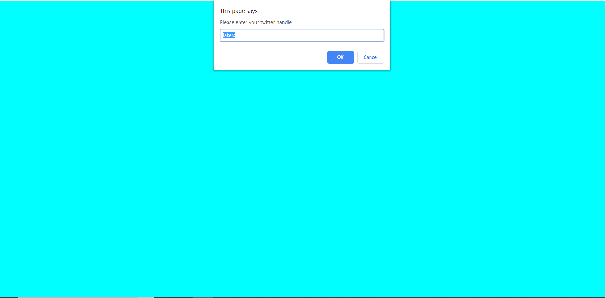

# Client Side Web Scrape (Deprecated)
An experiment with a client side web scraping script. The script can scrape without the need for a server or backend. This web scraping script will scrape Twitter for a user selected account and output the account's profile picture and 20 most recent tweets. After scrape completion, the user can select the "legitimize" button, which will replace the custom formatted tweets with an official Twitter widget (which preserves the tweet's native content and formatting, as well as enables access to all public tweets).

# BEFORE

# PROMPT

# AFTER SCRAPE

# AFTER LEGIT

